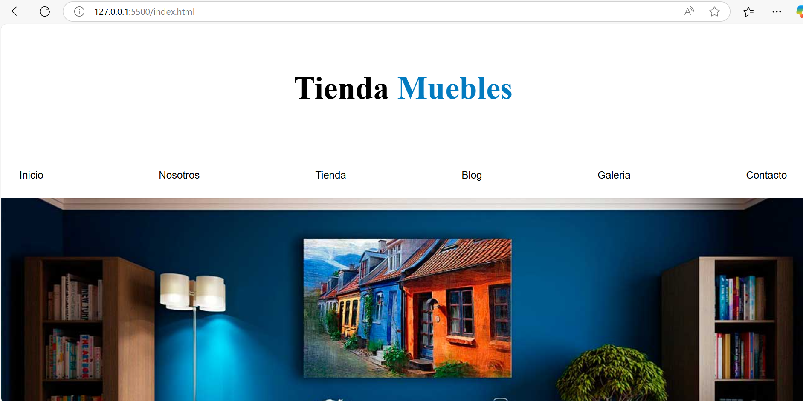
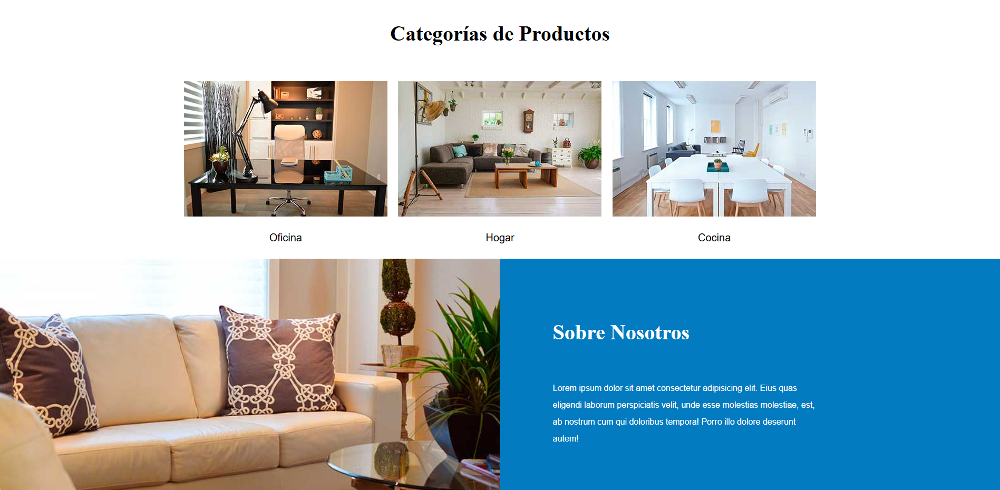
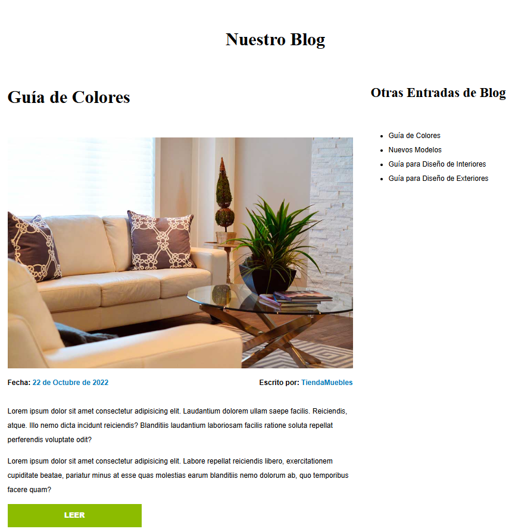
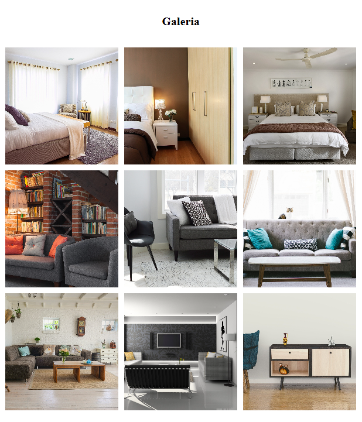
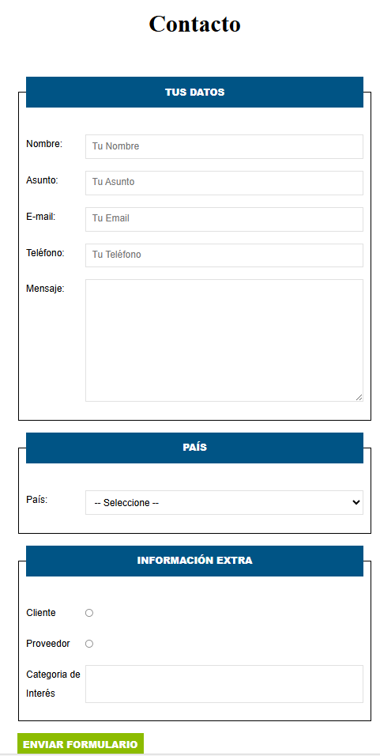

#  Proyecto 1 - eCommerce 🛒

**Descripción:**
Este es el primer proyecto del curso de CSS, donde se desarrolló una tienda de muebles en línea utilizando únicamente **HTML y CSS**. El objetivo fue aplicar conceptos de diseño responsivo, flexbox, grid, normalización.

## 🛠️ Tecnologías Usadas
- **HTML5**
- **CSS3** (Flexbox, Grid, normalización, etc.)

## 📦 Instalación y Uso
1. Clonar el repositorio:
   ```bash
   git clone https://github.com/GustavoGutierrez21/CURSOCSS-01eCommerce
   ```
2. Entrar en la carpeta del proyecto:
   ```bash
   cd CURSOCSS-01eCommerce
   ```
3. Abrir el archivo `index.html` en un navegador.

## ✨ Características  
- Uso de Flexbox y Grid para la maquetación.
- Normalización para todos los navegadores.
- Estilos personalizados para botones y tarjetas de producto.

## 📸 Capturas de Pantalla  







## 📄 Curso
Este código fue realizado con base al curso de Juan Pablo De la torre Valdez en [Udemy](https://www.udemy.com/course/css-grid-y-flexbox-la-guia-definitiva-crea-10-proyectos/?couponCode=LETSLEARNNOW) llegando a "Sección 5.